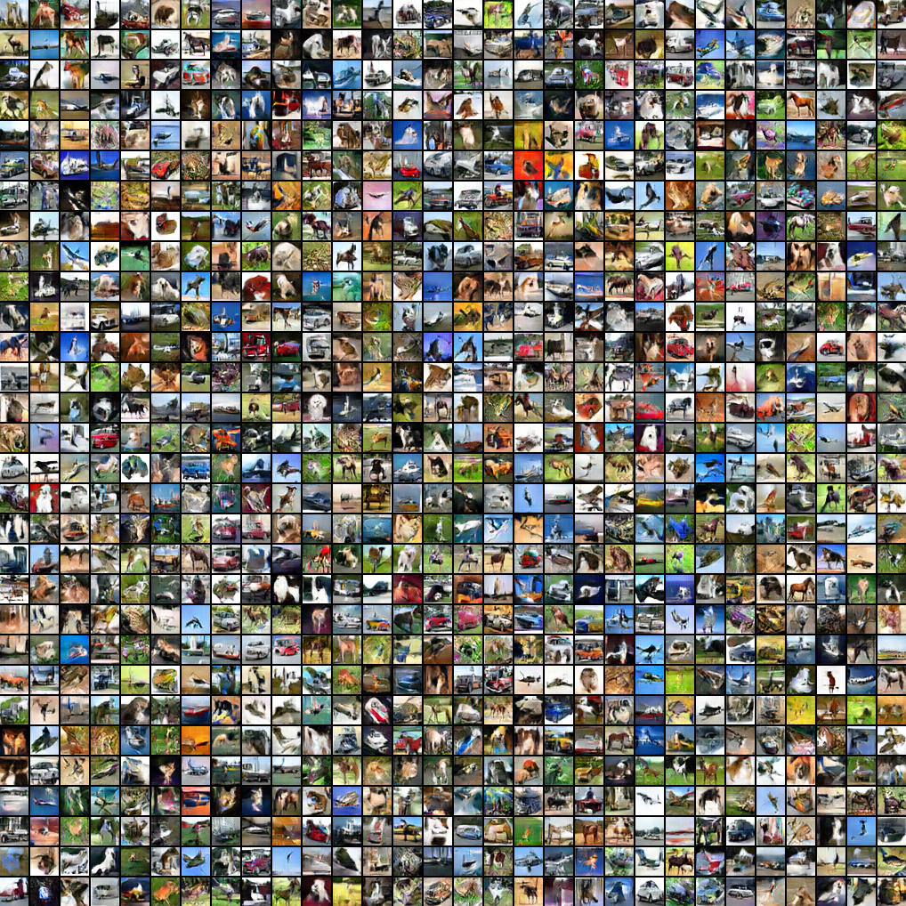
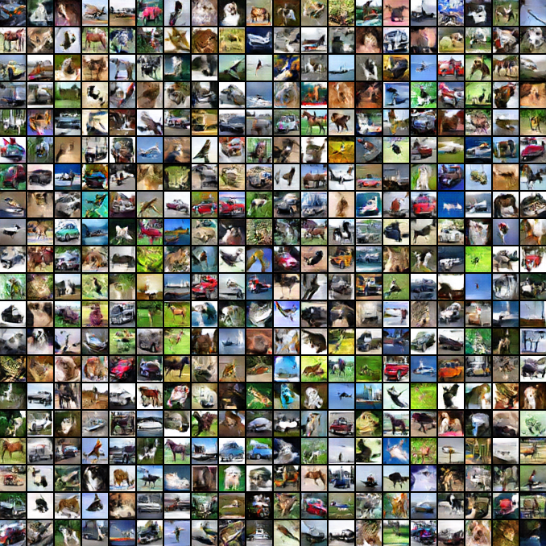
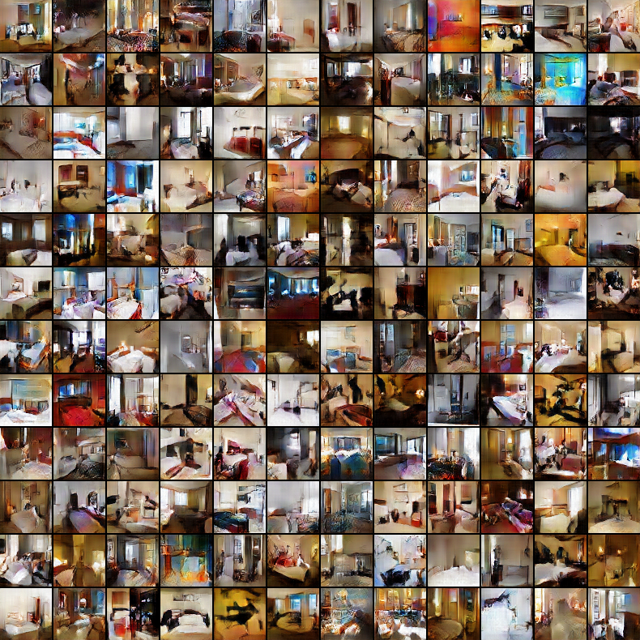
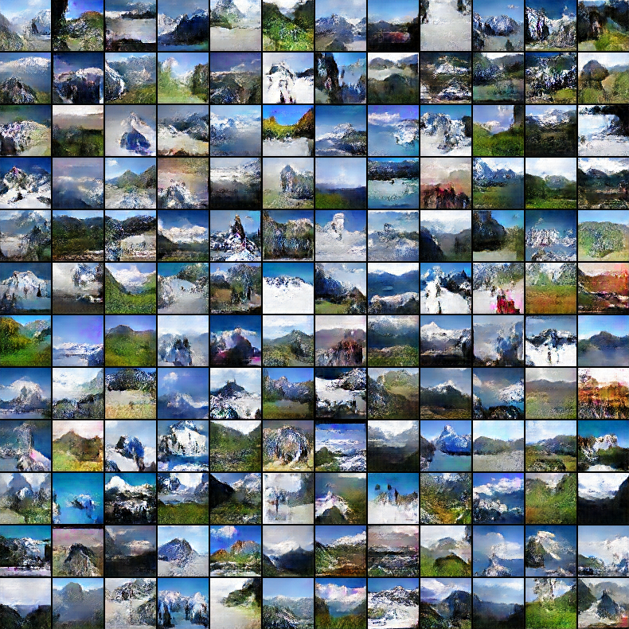

# Cooperative Learning of Energy-Based Model and Latent Variable Model via MCMC Teaching
This repository is a pytorch implementation for the paper <a href="http://www.stat.ucla.edu/~jxie/CoopNets/CoopNets.html">
Cooperative Learning of Energy-Based Model and Latent Variable Model via MCMC Teaching</a>

Checkout the original tensorflow implementation <a href="https://github.com/zilongzheng/CoopNets">here</a>

## Requirements	
- Python3
- [Pytorch](https://pytorch.org/) >=0.4.0
- Opencv
- numpy
- tensorflow-gpu (if you are trying to get inception score or FID)

## Installation
Clone the repository

    $ git clone https://github.com/FANG-Xiaolin/pytorch-CoopNets.git

You can simply install the requirements via `pip`. (A virtualenv is recommended)

    $ pip install opencv-python
    $ pip install torch==0.4.0 torchvision
    $ pip install numpy

Pretrained models for cifar has been provided in `./test`

## Demo

Load the pretrained model and generate sample images.

Specify the path to checkpoint in the command line. By default, the result will 
be saved to `./result_images`, or you can change it by `-output_dir /path/to/test-result`.

E.g. Generate 10 examples, each with 20x20 images by the following line.

    $ python main.py -test -output_dir ./test_res -ckpt_gen ./test/ckpt_gen.pth -ckpt_des ./test/ckpt_des.pth -test_size 10 -nRow 20 -nCol 20

## Testing

Load the pretrained model and generate sample images, then evaluate by 
<a href="http://papers.nips.cc/paper/6125-improved-techniques-for-training-gans.pdf">inception_score</a> or 
<a href="https://arxiv.org/pdf/1706.08500.pdf">FID</a>. The code to calculate scores
are from the author's original implementation.

Specify the path to checkpoint in the command line. By default, the result will 
be saved to `./result_images`, or you can change it by `-output_dir /path/to/test-result`.

Please make sure the `langevin_step_size` is the same as your training setting. For checkpoint
provided in the `test` folder, langevin_step_num is 8

#### FID
E.g. 
    
    $ python main.py -test -test_fid -img_size 32 -ckpt_gen ./test/ckpt_gen_cifar.pth -ckpt_des ./test/ckpt_des_cifar.pth -output_dir ./test-fid -langevin_step_num_des 8

#### Inception Score
E.g.

    $ python main.py -test -test_inception -dataset_size 60000 -img_size 32 -ckpt_gen ./test/ckpt_gen_cifar.pth -ckpt_des ./test/ckpt_des_cifar.pth -output_dir ./test-incep -langevin_step_num_des 8

## Training
1. Download the dataset

#### ImageNet-Scene
To train on ***scene*** subset of  ImageNet,
run the following command at the root directory of the project.

    $ python download.py scene
    
The ImageNet-scene dataset will be downloaded and saved to `./data` directory. (approximately 3.8G)

#### Cifar
Download the original `tar.gz` file, unzip it, and run 

    $ python convert_cifar.py
    
to convert it to seperated images.

2. Train a model by

 
    $ python main.py
    
    
The training images will be read from `[specified_data_path]/[specified_category]`

E.g.
Train the model on ***alp*** dataset  by

    $ python main.py -category alp -num_epoch 300 -lr_des 0.01 --lr_gen 0.0001
   
E.g. 
Train the model on ***cifar10*** dataset by

    $ python main.py -set cifar -category cifar -img_size 32 -lr_des 0.003 -langevin_step_size_des 0.001 -langevin_step_num_des 15 -sigma_des 0.016 -num_epoch 500 -log_epoch 50 -batch_size 300 -nRow 30 -nCol 30 -data_path ./data/scene/
    

By default, the result will be save to `./result_images`, the checkpoints and 
log will be saved into 
`./checkpoint`

Details about the flags can be seen by 

    $ python main.py -h
    
    
## Result

#### Result on `cifar10`(60k images)

##### Result on `desert-sand`(about 5k images) and `hotel-room`(about 5k images) subset of MIT-Place Dataset

Below is the result_image after training on `alp`(about 2k images) within hundreds of epochs.

## Reference
    @inproceedings{coopnets,
        author = {Xie, Jianwen and Lu, Yang and Gao, Ruiqi and Wu, Ying Nian},
        title = {Cooperative Learning of Energy-Based Model and Latent Variable Model via MCMC Teaching},
        booktitle = {The 32nd AAAI Conference on Artitifical Intelligence},
        year = {2018}
    }
    
    

## Acknowledgement
Thanks to <a href="https://github.com/jianwen-xie">@Jianwen-Xie</a> and 
<a href="https://github.com/zilongzheng">@Zilong-Zheng</a> for their
 <a href="github.com/zilongzheng/CoopNets">tensorflow implementation</a>

