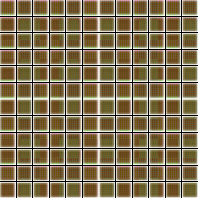
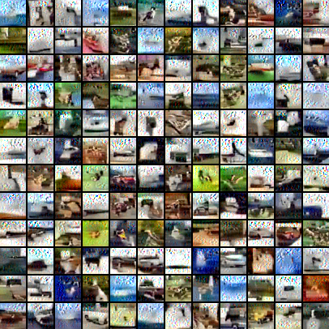

##Some note on training CoopNet and measuring results

###For training
1. About LR

A small learning rate may result in some strange square texture like below 
(and won't generate realistic patterns even after hundreds of epochs). You can 
first set an initial learning rate and gradually decrease it if gradient explosion 
occurs frequently.

E.g.

2. Gradient explosion 

Gradient explosion may occur if the parameter are not set appropriately. 

**Possible reasons for gradient explosion:**
- Large LR
- Large step_size
- Large step_num
- Small sigma

If gradient explosion happens frequently, then one or several factors above may exist.

And if you notice some strange noise, blurry objects in your generated image, gradient 
explosion may happen in a few epochs

E.g. 2 epochs before gradient explosion

3. Set a larger learning rate for descriptor compared to generator. (For CoopNet,
 the generator is doing supervised learning so it can learn the weights easily)

4. Noise

If disable the noise at the very first begining of training, it will take more 
time for the CoopNet to generate reasonable patterns. But there's not much difference 
between the final results after some epochs(after about 150 epochs on cifar). A better choice 
is too add noise at first and disable the noise after 100 epochs.

5. Check the magnitude

Set the `sigma` carefully. You can check the `x_grad` and `x`, compare their magnitude,
and set an appropriate `sigma` as well as `step_size` to make sure the langevin won't go too
far and also make sure the direction of langevin is led by the gradient. Since both `step_size`
and `sigma` are in quadratic form, a slight change may also lead to a change in magnitude.
When training cifar, the second term of Langevin(0.5\*stepsize\*stepsize\*...) is about 
1/100 of `x`.

6. Step size

A large `step_num` for descriptor may result in some noise in the generated images(looks
like salt&pepper noise). A large `step_size` may generate some distored objects.

7. Though the descriptor_loss, generator_loss and reconstruction_loss may not directly
shows the quality of generated images, you can infer from the reconstruction_loss. Usually,
a lower recon_loss shows a better result. But if you observe a sudden drop of recon_loss between
two epochs, then probably the result is getting worse at that point. But normally it will return
to the previous quality after dozens of epochs.

8. z_size

A larger z_size can make the result a little bit better but no big difference. But if it 
is too small, CoopNet can't learn anything.

9. Chain Number (nRow x nCol)

A larger chain_number is usually better since there are more parallel chain during 
the MCMC sampling. 20\*20 is better than 12\*12 but no big difference between 20\*20
and 30\*30.

10. Use leakyReLU in discriptor.

### For Testing
1. Save checkpoints in a regular base. Sometimes the generated images looks similar
but there may be a gap of 5 in fid or 0.5 in inception score between dozens of epochs.
Sometimes the result from earlier epochs are better.

2. When generating testing images, make sure to set the `batch_size` the same as the training
setting. Or it will sometimes make a significant difference between result(E.g. There is BatchNorm layer or 
[get_mean] operation in Langevin Dynamics). For pytorch-CoopNet, the batch_size during testing
is set by `nRow` and `nCol`.

3. When testing inception score, if there is an ERROR on `o._shape`, degrade the tf version
to 1.3.0 may help.

4. If you are trying to read the images and then fed to the `get_inception_score` function,
make sure the RGB channel is in correct order. CV2 reads in images in BGR and we need RGB 
during testing, else it would be a 60+ gap in FID or 3+ gap in inception score.

